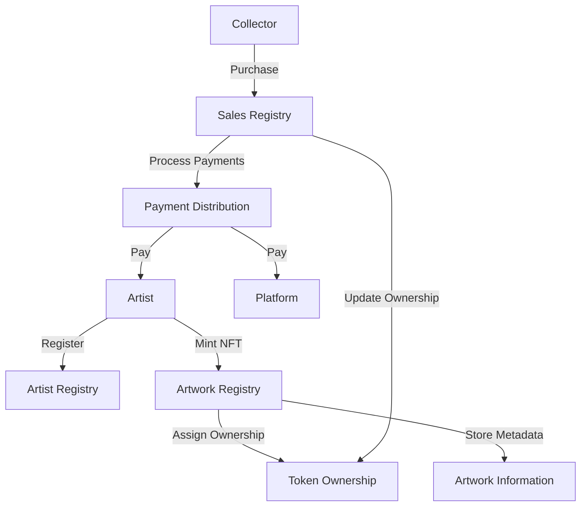

# PixelMint Art Platform

A specialized NFT platform dedicated to pixel art creators and collectors on the Stacks blockchain, enabling artists to mint, sell, and manage unique pixel art NFTs with automated royalties and provenance tracking.

## Overview

PixelMint empowers pixel artists to tokenize their artwork as NFTs with specific features tailored for pixel art:

- Mint pixel art as verifiable NFTs with embedded metadata
- Support for various pixel art dimensions and color palettes
- Automated royalty distribution on secondary sales
- Artist registration and profile management
- Secure ownership tracking and transfer capabilities
- Built-in marketplace functionality

## Architecture

The platform is built around a single smart contract that manages all core functionality. Here's how the components interact:



## Contract Documentation

### Core Components

1. **Artist Registry**
   - Tracks registered artists
   - Stores artist profiles and credentials

2. **Artwork Management**
   - Handles NFT minting
   - Stores artwork metadata and pixel data
   - Manages ownership records

3. **Marketplace Functions**
   - Facilitates buying and selling of NFTs
   - Handles royalty calculations and distributions
   - Manages sale listings

### Key Features

- **Automated Royalties**: Up to 30% royalty rate for original creators
- **Platform Fee**: 5% fee on all sales
- **Metadata Storage**: Supports detailed artwork information including dimensions, color palettes
- **Ownership Tracking**: Maintains accurate records of NFT ownership

## Getting Started

### Prerequisites

- Clarinet CLI installed
- Stacks wallet for deployment and testing

### Basic Usage

1. **Register as an Artist**
```clarity
(contract-call? .pixelmint register-artist "artist_name" "Artist bio here")
```

2. **Mint an Artwork**
```clarity
(contract-call? .pixelmint mint-artwork 
    "Artwork Title"
    "Description"
    "pixel_data_base64"
    u32 ;; width
    u32 ;; height
    "color_palette"
    u10 ;; royalty percentage
    none ;; additional metadata
)
```

3. **List for Sale**
```clarity
(contract-call? .pixelmint list-for-sale u1 u1000000) ;; token-id, price in STX
```

## Function Reference

### Artist Management

```clarity
(register-artist (username (string-ascii 50)) (bio (string-utf8 500)))
(update-artist-profile (username (string-ascii 50)) (bio (string-utf8 500)))
```

### NFT Operations

```clarity
(mint-artwork (title (string-utf8 100)) (description (string-utf8 500)) ...)
(transfer-nft (token-id uint) (recipient principal))
(update-artwork-metadata (token-id uint) (title (string-utf8 100)) ...)
```

### Marketplace Functions

```clarity
(list-for-sale (token-id uint) (price uint))
(cancel-sale (token-id uint))
(buy-nft (token-id uint))
```

### Read-Only Functions

```clarity
(get-artist-info (artist principal))
(get-artwork-info (token-id uint))
(get-token-owner (token-id uint))
(get-sale-info (token-id uint))
```

## Development

### Local Testing

1. Clone the repository
2. Install dependencies: `clarinet requirements`
3. Run tests: `clarinet test`

### Deployment

1. Build the contract: `clarinet build`
2. Deploy using the Stacks CLI or wallet

## Security Considerations

### Limitations

- Maximum pixel data length: 16,384 bytes
- Maximum royalty percentage: 30%
- Platform fee: Fixed at 5%

### Best Practices

1. Always verify transaction status
2. Check ownership before operations
3. Validate prices and royalty calculations
4. Be aware of gas costs for larger pixel art data

### Error Handling

The contract includes comprehensive error codes:
- `ERR-NOT-AUTHORIZED (u100)`
- `ERR-ALREADY-REGISTERED (u101)`
- `ERR-NOT-REGISTERED (u102)`
- And more...